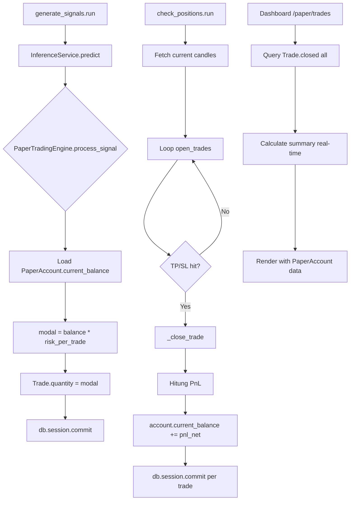

# Plan: Fix Paper Trading Balance & Dashboard PnL Sync

## Problem Summary

1. **Fixed 1000 USD per trade**: `PaperTradingEngine` selalu menggunakan `modal_per_trade = 1000.0` untuk setiap trade tanpa tracking equity/running balance.
2. **Dashboard PnL mismatch**: Ringkasan dashboard menggunakan `PerformanceSummary` yang di-refresh setiap 6 jam, sehingga data tidak sinkron dengan trade terbaru.

---

## Todo List

### Phase 1: PaperAccount Model + Balance Tracking

#### 1.1 Buat Model `PaperAccount`
- **File baru:** `app/models/paper_account.py`
- **Field:**
  - `id` (Integer PK)
  - `initial_balance` (Float, default 10000.0)
  - `current_balance` (Float, default 10000.0)
  - `total_pnl` (Float, default 0.0)
  - `total_trades` (Integer, default 0)
  - `peak_balance` (Float)
  - `max_drawdown` (Float)
  - `updated_at` (DateTime)
- **Action:** `db.create_all()` atau migration di `app/__init__.py` akan auto-create tabel.

#### 1.2 Seed Initial Balance di `_auto_seed()`
- **File:** `app/__init__.py`
- Setelah semua coin di-seed, buat satu `PaperAccount` dengan `initial_balance` dari config (`risk.initial_balance` atau default 10000.0).

#### 1.3 Update `config_loader.py` atau inference_config.json
- Tambahkan field `initial_balance` di section `risk` di `inference_config.json`.
- Fallback: jika tidak ada, gunakan 10000.0.

### Phase 2: Position Sizing Berdasarkan Equity

#### 2.1 Ubah `PaperTradingEngine.__init__()`
- **File:** `app/services/paper_trading.py`
- Tambahkan `self._risk_per_trade` (default 0.10 = 10% dari equity).
- Hapus `self._modal_per_trade` atau ubah cara pakainya.
- Load `PaperAccount` dari database.

#### 2.2 Ubah `process_signal()` — Position Size dari Equity
- **File:** `app/services/paper_trading.py`
- Alih-alih `modal = self._modal_per_trade`:
  ```python
  account = PaperAccount.query.first()
  modal = account.current_balance * self._risk_per_trade
  ```
- Simpan `modal` sebagai `quantity` di Trade (seperti sekarang).
- Pastikan modal minimal $10 untuk menghindari dust.

#### 2.3 Update Balance di `_close_trade()`
- **File:** `app/services/paper_trading.py`
- Setelah menghitung PnL:
  ```python
  account = PaperAccount.query.first()
  account.current_balance += pnl_net
  account.total_pnl += pnl_net
  account.total_trades += 1
  if account.current_balance > account.peak_balance:
      account.peak_balance = account.current_balance
  dd = (account.peak_balance - account.current_balance) / account.peak_balance
  account.max_drawdown = max(account.max_drawdown or 0, dd)
  ```
- Panggil `db.session.add(account)` sebelum commit.

### Phase 3: Dashboard Real-time Summary

#### 3.1 Ubah `app/api/trades.py` — Prioritaskan Data Real-time
- **File:** `app/api/trades.py`
- Ubah logika summary: hitung langsung dari `Trade.query.filter_by(status="closed")` setiap kali halaman di-load.
- Opsional: tetap update `PerformanceSummary` di background thread.
- Tambahkan `PaperAccount` info ke template (balance, drawdown).

#### 3.2 Update Template `trades.html`
- **File:** `app/templates/trades.html`
- Tambahkan kartu "Account Balance" yang menunjukkan `current_balance`.
- Tambahkan kartu "Drawdown" dari PaperAccount.

### Phase 4: Robust Error Handling

#### 4.1 Fix Commit di `check_open_positions()`
- **File:** `app/services/paper_trading.py` method `check_open_positions()`
- Pindahkan try/except per-trade:
  ```python
  for trade in open_trades:
      try:
          ...
          if exit_price is not None:
              self._close_trade(trade, exit_price, exit_reason)
              closed.append(trade)
              db.session.commit()  # commit per trade
      except Exception as e:
          db.session.rollback()
          logger.error(f"Gagal close trade {trade.id}: {e}")
  ```

### Phase 5: Migration Existing Trades

#### 5.1 Hitung Initial Balance dari Closed Trades
- Script atau logika di `_auto_seed()` atau migration:
  ```python
  total_pnl = db.session.query(db.func.sum(Trade.pnl_net)).filter(Trade.status == "closed").scalar() or 0.0
  account.current_balance = account.initial_balance + total_pnl
  ```

---

## Mermaid Diagram: Flow Usulan



---

## Files to Modify/Create

| File | Action | Description |
|------|--------|-------------|
| `app/models/paper_account.py` | **CREATE** | PaperAccount ORM model |
| `app/services/paper_trading.py` | **MODIFY** | Balance tracking, equity-based sizing, per-trade commit |
| `app/api/trades.py` | **MODIFY** | Real-time summary calculation |
| `app/templates/trades.html` | **MODIFY** | Add balance/drawdown cards |
| `app/__init__.py` | **MODIFY** | Auto-seed PaperAccount, run migration |
| `models/inference_config.json` | **MODIFY** | Add `risk.initial_balance` field |
| `app/services/model_registry.py` | **MODIFY** (minor) | Add `initial_balance` loader if needed |
| `AUDIT_REPORT.md` | **OVERWRITE** (already done) | Audit findings |
